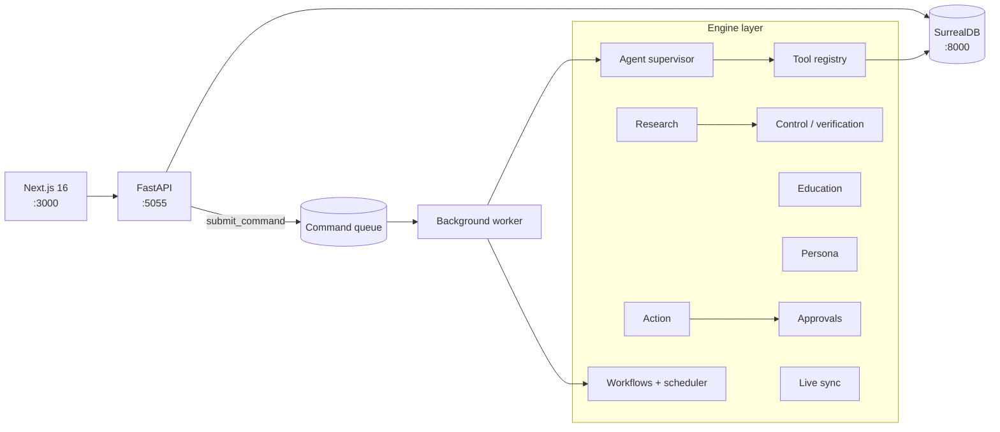

<div align="center">

# Agentic Open Notebook

**A multi-agent knowledge operating system built on top of
[Open Notebook](https://github.com/lfnovo/open-notebook).**

*Powerful underneath. Simple on the surface.*

[](LICENSE)
[](pyproject.toml)
[](frontend/package.json)
[](tests/)

</div>

---

##  A derivative of Open Notebook

This project is a **fork and extension** of
[**Open Notebook**](https://github.com/lfnovo/open-notebook) by
[Luis Novo](https://github.com/lfnovo), the open-source, privacy-focused
alternative to Google's Notebook LM.

We keep the entire upstream foundation — the three-tier architecture
(Next.js → FastAPI → SurrealDB), multi-provider AI (18+ providers via
Esperanto), multi-speaker podcasts, vector/text search, and the 14-locale UI —
and add a **multi-agent orchestration layer** on top of it.

> **Upstream:** <https://github.com/lfnovo/open-notebook> ·
> **Website:** <https://www.open-notebook.ai> ·
> **License:** MIT ([`LICENSE`](LICENSE), copyright © Luis Novo)

---

##  What we added

| Engine | What it does |
|---|---|
| **Agent Engine** | A supervisor (`plan → execute → decide → finalize`) orchestrates 10 specialized agents across a safe tool registry |
| **Control Layer** | Labels every claim `verified / external / inferred / unverified`; contradiction & hallucination checks |
| **Research** | `gather → synthesize → fact-check` produces source-cited reports with verification labels |
| **Education** | Turns any source into a study plan, explanation, quiz and flashcards |
| **Persona** | Re-interprets material from any expert perspective |
| **Live Sync** | Diffs external sources (Google Drive) into your knowledge base, deduped by content hash |
| **Action + Approvals** | External actions (email, Jira) execute only after human approval |
| **Workflow + Scheduler** | Run registered tool-step workflows on demand or hourly/daily/weekly |
| **Multi-user foundation** | `user` table + users API |
| **Redesigned UI** | Modern indigo design system, Home dashboard, non-technical navigation |

Read the full story in [**docs/agentic/**](docs/agentic/README.md):

- [Architecture](docs/agentic/architecture.md)
- [What we built](docs/agentic/what-we-built.md)
- [Feature catalogue](docs/agentic/features.md)
- [Roadmap](docs/agentic/roadmap.md)

---

##  Architecture



Every long-running operation is a `surreal-commands` background job — the API
never blocks on podcast generation, embeddings, source processing or agent runs.

---

##  Features (upstream + ours)

-  **Private & self-hosted** — your data stays yours
-  **Multi-provider AI** — OpenAI, Anthropic, Ollama, LM Studio and 15+ more
-  **Multi-agent orchestration** — delegate a goal, the supervisor does the rest
-  **Verification layer** — every claim gets an evidence label
-  **Multi-modal sources** — PDFs, video, audio, web pages
-  **Multi-speaker podcasts** — 1–4 speakers with custom profiles
-  **Full-text + vector search** across everything
-  **Context-aware chat** with citations
-  **Study material generation** — plans, quizzes, flashcards
-  **Live sync & actions** — Google Drive, email, Jira
-  **14-locale UI**

---

##  Quick start

### Docker (recommended)

```bash
git clone https://github.com/koraysrn/agentic-open-notebook.git
cd agentic-open-notebook
docker compose up
```

Open <http://localhost:3000>. Configure your AI models in **Settings → Models**
(or set API keys in the UI). For local models, start [Ollama](https://ollama.com)
and run:

```bash
ollama pull qwen2.5            # chat model
ollama pull nomic-embed-text   # embedding model
```

Then add both in **Settings → Models** (provider `ollama`). A helper script is
available for headless setup:

```bash
uv run python scripts/configure_ollama_models.py
```

### Local development

Three tiers, started in order:

```bash
make database     # SurrealDB
make api          # FastAPI (migrations run automatically)
make worker-start # surreal-commands worker (podcasts/embeddings/agents)
make frontend     # Next.js UI
```

Or all at once: `make start-all` · status: `make status` · stop: `make stop-all`.

> See [Open Notebook's docs](docs/0-START-HERE/index.md) and
> [docs/1-INSTALLATION/](docs/1-INSTALLATION/) for full installation and
> configuration guides.

---

##  Tests & quality

```bash
uv run pytest tests/        # 761 backend tests
cd frontend
npm run test                # 140 frontend tests
npm run lint
npm run build
```

CI runs the same suite on every push (see
[`.github/workflows/test.yml`](.github/workflows/test.yml)).

---

##  Built with

[Python](https://www.python.org/) ·
[FastAPI](https://fastapi.tiangolo.com/) ·
[Next.js](https://nextjs.org/) ·
[React](https://react.dev/) ·
[SurrealDB](https://surrealdb.com/) ·
[LangChain](https://www.langchain.com/) ·
[LangGraph](https://langchain-ai.github.io/langgraph/) ·
[Esperanto](https://github.com/lfnovo/esperanto)

---

##  License & attribution

Distributed under the **MIT License** — see [`LICENSE`](LICENSE).

This project is a derivative of **Open Notebook** © Luis Novo
(<https://github.com/lfnovo/open-notebook>), used under the MIT License. The
original copyright notice is preserved in [`LICENSE`](LICENSE).

