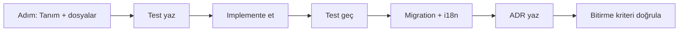

# PROJE MİMARİSİ.md Uçtan Uca Uygulama Yol Haritası

Bu plan, [`PROJE MİMARİSİ.md`](PROJE MİMARİSİ.md:1) dosyasındaki 7 fazı ve 11 motoru **baştan sona, adım adım** hayata geçirmek için hazırlandı. Her adımda ne yapılacağı, hangi dosyalara dokunulacağı, bitirme kriteri ve o adımın riskleri/çözümleri ayrı ayrı verildi. Sonda bütün risklerin tek tek nasıl bertaraf edileceği özetlendi.

---

## 0. ÇALIŞMA YÖNTEMİ (tüm adımlarda geçerli)

Bu 6 kural her adımda uygulanır; kural ihlali sonraki adımları bozar:

1. **Dikey dilim:** Her adım, tek başına çalışan, test edilebilir bir parça biter. "Yarım motor" bırakılmaz.
2. **Test-first:** Backend'de `uv run pytest tests/`, frontend'de `npm run test`. Her adım bir test dosyasıyla kapanır ([`docs/7-DEVELOPMENT/testing.md`](docs/7-DEVELOPMENT/testing.md:1)).
3. **Migration disiplini:** Yeni tablo = `N.surrealql` + `N_down.surrealql` + [`AsyncMigrationManager`](open_notebook/database/async_migrate.py:1)'a elle kayıt. Üçü birden, aynı PR'da ([`docs/7-DEVELOPMENT/change-playbooks.md`](docs/7-DEVELOPMENT/change-playbooks.md:110)).
4. **Karar kaydı:** Yapısal her karar, yarım sayfalık ADR/PDR olarak yazılır ([`docs/7-DEVELOPMENT/decisions/README.md`](docs/7-DEVELOPMENT/decisions/README.md:19)).
5. **Async-first:** Uzun işler inline değil, `surreal-commands` job'u olur ([`ADR-004`](docs/7-DEVELOPMENT/decisions/ADR-004-background-workers.md:1)).
6. **Provider-agnostic:** Her LLM çağrısı [`provision_langchain_model()`](open_notebook/ai/provision.py:10) üzerinden; asla provider hard-code edilmez.

---

## 1. FAZ 1 — OPEN NOTEBOOK TEMELİ

### Adım 0 — Ortam doğrulama ve güvenli taban

**Detay:**
- `.env` dosyasına `OPEN_NOTEBOOK_ENCRYPTION_KEY` koy ([`open_notebook/AGENTS.md`](open_notebook/AGENTS.md:72)).
- Sırayla `make database` → `make api` → `make worker-start` → `make frontend` çalıştır ([`AGENTS.md`](AGENTS.md:11)).
- Swagger'ı (`http://localhost:5055/docs`) aç, migration loglarında hata olmadığını doğrula.
- `uv run pytest tests/` ve `cd frontend ; npm run test` çalıştır — **her şey yeşil olmadan 1. adıma geçme.**

**Bitirme kriteri:** 4 servis ayakta; tüm testler yeşil; migration'lar başarılı.

**Risk & çözüm:** Worker unutulursa podcast/embedding işleri sessizce kuyrukta kalır ([`ADR-004`](docs/7-DEVELOPMENT/decisions/ADR-004-background-workers.md:25)). Çözüm: `make status` ile worker'ın çalıştığını her oturum başında doğrula.

### Adım 1 — Extension point envanteri + mimari karar kaydı

**Detay:**
- Mevcut router'ları ([`api/routers/`](api/routers/__init__.py:1)), grafları ([`open_notebook/graphs/`](open_notebook/graphs/ask.py:148)), domain modellerini ([`open_notebook/domain/base.py`](open_notebook/domain/base.py:32)), prompt'ları ve komutları bir tabloya çıkar.
- Her hedef motorun nereye "takılacağını" eşleştir (bkz. Bölüm 3 boşluk analizi, önceki rapor).
- **İlk ADR'yi yaz:** "Agent Engine'i Open Notebook çekirdeğine gömme kararı" — supervisor deseni, tool registry konumu, state kalıcılığı. Bu, en pahalı karar; ilk adımda yazılı hale gelmeli.

**Bitirme kriteri:** `docs/7-DEVELOPMENT/decisions/ADR-008-agent-architecture.md` + envanter tablosu hazır.

**Risk & çözüm:** Karar yazılmazsa her fazda "neden böyle yaptık" tartışması yeniden açılır. Çözüm: ADR'yi ilk PR'da commit'le.

### Adım 2 — Lisans ve dağıtım kontrolü

**Detay:** [`LICENSE`](LICENSE:1) MIT olduğunu doğrula; fork/dağıtım koşullarını ve attribution gereksinimini belgele. Kendi ürün adını/versiyonunu [`pyproject.toml`](pyproject.toml:2) içinde planla.

**Bitirme kriteri:** Lisans notu ve ürün adlandırma kararı yazılı.

---

## 2. FAZ 2 — AGENT ENGINE

### Adım 3 — Agent soyutlaması + registry

**Detay:**
- Yeni paket: `open_notebook/agents/` (çekirdeğe additive, mevcut kodu bozmaz).
- `Agent` temel sınıfı (Pydantic): `name`, `description`, `capabilities`, `tools`, `system_prompt`.
- `AgentRegistry`: kayıt, arama, yetenek bazlı seçim.
- Başlangıç agent seti (belgedeki listeyle): Orchestrator, Research, Education, Presentation, Report, Podcast, FactChecker, Control, Persona, Action.

**Bitirme kriteri:** `tests/test_agent_registry.py` yeşil; agent kaydı/değiştirilmesi çalışıyor.

**Risk & çözüm:** Aşırı soyutlama (over-engineering) tuzağı — [`design-principles.md`](docs/7-DEVELOPMENT/design-principles.md:89). Çözüm: önce 2-3 gerçek agent yaz, soyutlama sonra çıkar.

### Adım 4 — Tool Registry (araç katmanı)

**Detay:**
- [`open_notebook/graphs/tools.py`](open_notebook/graphs/tools.py:7) içindeki tek aracı genişlet; her araç Open Notebook API'sini/domain'ini saran ince fonksiyon olur: `list_notebooks`, `search_sources`, `get_source_content`, `create_note`, `list_notes`, `get_current_timestamp`.
- Araçlar asla DB'ye doğrudan erişmez — `repo_query`/domain üzerinden gider (katman sızması yasak, [`design-principles.md`](docs/7-DEVELOPMENT/design-principles.md:35)).
- Her araç için birim test.

**Bitirme kriteri:** Tool registry'de 6+ çalışan araç, testleriyle birlikte.

**Risk & çözüm:** Tool-calling'in her provider'da aynı çalışmaması. Çözüm: araçları JSON çıktı + `PydanticOutputParser` ile provider'dan bağımsız tut ([`graphs/ask.py`](open_notebook/graphs/ask.py:52) deseni).

### Adım 5 — Orchestrator (supervisor deseni)

**Detay:**
- [`open_notebook/graphs/ask.py`](open_notebook/graphs/ask.py:148) içindeki "planla → ara → cevapla" desenini **supervisor**'a dönüştür: kullanıcı isteğini çözümle → hangi agent/tool'u çağıracağını seç → alt agent'ı çalıştır → sonucu topla.
- Yeni graf: `open_notebook/graphs/agent.py`; prompt'lar `prompts/agent/*.jinja`.
- `classify_error()` sarmalayıcısını her node'da kullan ([`open_notebook/AGENTS.md`](open_notebook/AGENTS.md:32)).

**Bitirme kriteri:** "Veritabanı sınavına hazırlanmama yardım et" örneğindeki planlama akışının **plan kısmı** uçtan uca çalışıyor (gerçek education üretimi olmadan, plan + tool seçimi).

**Risk & çözüm:** Supervisor döngüsünde sonsuz araç çağrısı. Çözüm: maksimum iterasyon sınırı + bütçe/token limiti koy, test et.

### Adım 6 — Agent state + kalıcılık

**Detay:**
- Çok adımlı agent çalışmasının yarıda kalmaması için SQLite checkpoint örüntüsünü (chat'teki `LANGGRAPH_CHECKPOINT_FILE`) agent graflarına uygula.
- Gerekirse `agent_run` tablosu (migration 24): `id`, `notebook_id`, `agent`, `state_json`, `status`, `created`, `updated`.

**Bitirme kriteri:** Bir agent işi API yeniden başlasa bile devam ettirilebiliyor.

**Risk & çözüm:** Checkpoint ID çakışması ([`docs/7-DEVELOPMENT/architecture.md`](docs/7-DEVELOPMENT/architecture.md:793)). Çözüm: benzersiz run ID üret; test ile doğrula.

### Adım 7 — İlk dikey dilim: Agent API + UI

**Detay:**
- Yeni router `api/routers/agents.py` + servis `api/agent_service.py`; [`api/main.py`](api/main.py:383) içinde `app.include_router` kaydı.
- Uzun çalışan işler için `commands/agent_commands.py` (fire-and-forget + durum ucu).
- Frontend dörtlüsü ([`change-playbooks.md`](docs/7-DEVELOPMENT/change-playbooks.md:36)): `types/api.ts` → `lib/api/agents.ts` → `lib/hooks/use-agents.ts` → bileşen.
- i18n: her yeni string `en-US` referansıyla **tüm locale dosyalarına** ([`frontend/AGENTS.md`](frontend/AGENTS.md:14)). Bu adımda mevcut 14 locale zorunluluğunu koru ya da kendi dil stratejini ADR'ye yaz.

**Bitirme kriteri:** UI'dan bir notebook seçip "araştırma planı çıkar" dediğinde plan görünüyor.

**Risk & çözüm:** i18n yükü. Çözüm: bu adımda dil stratejisini kararlaştır (ör. `en-US` + `tr-TR`'ye indirgeyen bir ADR), sonra tutarlı uygula.

---

## 3. FAZ 3 — CONTROL LAYER

### Adım 8 — Kanıt ve citation doğrulama

**Detay:**
- Yeni graf `open_notebook/graphs/control.py` + prompt `prompts/control/verify.jinja`.
- Her üretilen iddia için kaynak/citation eşlemesini kontrol et; kaynaksız iddiayı "doğrulanmamış" olarak etiketle.
- Belgedeki 4 bilgi türünü veri modeline işle: `verified`, `external`, `inferred`, `unverified` ([`PROJE MİMARİSİ.md`](PROJE MİMARİSİ.md:317)).

**Bitirme kriteri:** Bir cevap, kaynak gösterimi + doğrulama etiketiyle dönüyor; kaynaksız iddialar kesin gerçek gibi sunulmuyor.

**Risk & çözüm:** Citation'ın "varmış gibi" üretilmesi. Çözüm: etiket yalnızca gerçek `source` kaydına bağlanınca `verified` olur; aksi halde `inferred`/`unverified` kalır.

### Adım 9 — Çelişki tespiti + güven skoru

**Detay:** Birden çok kaynak arasında çelişen ifadeleri LLM tabanlı karşılaştır; her çıktıya 0-1 güven skoru ekle. Skoru UI'da göster.

**Bitirme kriteri:** Çelişkili iki kaynakla test edilen çıktı, çelişkiyi işaretliyor.

**Risk & çözüm:** 17 provider'da deterministik olmama ([`PDR-002`](docs/7-DEVELOPMENT/decisions/PDR-002-provider-agnostic-core.md:1)). Çözüm: doğrulama prompt'unu provider'dan bağımsız, yapılandırılmış JSON çıktıyla tut; model kalitesine göre degrade et.

### Adım 10 — Halüsinasyon tespiti (best-effort, en sonda)

**Detay:** Kanıt yoksa "bilmiyorum" dedirtme + LLM-as-judge. Bunu mutlak doğruluk vaadi olarak değil **yardımcı sinyal** olarak konumlandır.

**Bitirme kriteri:** Kanıtsız soruda sistem "kaynaklarda kanıt bulunamadı" diyebiliyor.

**Risk & çözüm:** Halüsinasyon tespiti tam çözülemez bir araştırma problemi. Çözüm: beklentiyi doğru kur, deterministic değil best-effort olarak tasarla.

---

## 4. FAZ 4 — RESEARCH + LIVE SYNC

### Adım 11 — Web araştırma aracı

**Detay:**
- Yeni araç: `web_search` (harici arama sağlayıcı). Gelen her URL **mutlaka** [`validate_url()`](open_notebook/utils/url_validation.py:1) SSRF korumasından geçer.
- Sonuçları `external_source` olarak geçici sakla; kalıcı hale getirme kullanıcı onayıyla.

**Bitirme kriteri:** Bir soru, notebook içi + web sonuçlarını birlikte kullanıyor.

**Risk & çözüm:** SSRF/veri sızıntısı. Çözüm: `validate_url` zorunlu, harici servise yalnızca gerekli veri gönderilir ([`PROJE MİMARİSİ.md`](PROJE MİMARİSİ.md:675)).

### Adım 12 — Research workflow grafı

**Detay:** `open_notebook/graphs/research.py`: iç arama + dış arama → fact-check (Adım 8) → sentez → kaynak gösterimli rapor. Belgedeki "2024 raporu 2026'da geçerli mi?" akışı bu grafla gerçekleşir.

**Bitirme kriteri:** Güncellik analizi yapan uçtan uca bir araştırma akışı çalışıyor.

**Risk & çözüm:** Uzun süren araştırma API'yi kilitleyebilir. Çözüm: `commands/research_commands.py` ile job olarak çalıştır, durumu poll et.

### Adım 13 — Live Sync Engine çerçevesi

**Detay:**
- `sync_connection` tablosu (migration): `provider`, `oauth_token_encrypted`, `notebook_id`, `last_sync_at`, `status`.
- Token şifreleme [`open_notebook/utils/encryption.py`](open_notebook/utils/encryption.py:1) üzerinden; asla plaintext.
- Incremental sync tasarımı: değişen/silinen dosya tespiti, duplicate önleme, versiyon takibi ([`PROJE MİMARİSİ.md`](PROJE MİMARİSİ.md:420)).

**Bitirme kriteri:** Bağlantı tanımı + şifreli kimlik bilgisi + senkronizasyon iş modeli hazır.

**Risk & çözüm:** OAuth token sızıntısı. Çözüm: şifreli sakla, endpoint'lerden asla döndürme ([`open_notebook/AGENTS.md`](open_notebook/AGENTS.md:16)).

### Adım 14 — İlk entegrasyon: Google Drive

**Detay:** Tek bir dikey entegrasyon seç (Google Drive). OAuth akışı + sync job + `commands/sync_commands.py`. Başka entegrasyon eklemeden bunu tamamla.

**Bitirme kriteri:** Drive'a düşen yeni PDF otomatik kaynak olarak notebook'a giriyor.

**Risk & çözüm:** Entegrasyon başına ayrı OAuth/rate-limit yükü ([`PROJE MİMARİSİ.md`](PROJE MİMARİSİ.md:728)). Çözüm: entegrasyonu core'dan izole bağlayıcı olarak yaz, tek tek ekle.

---

## 5. FAZ 5 — EDUCATION + PERSONA

### Adım 15 — Persona Engine

**Detay:** `persona` tablosu; persona = sistem prompt'u + çıktı biçimi. Kaynaktaki gerçekler değişmez, yalnızca perspektif/format değişir ([`PROJE MİMARİSİ.md`](PROJE MİMARİSİ.md:466)). Mevcut `transformation` altyapısını persona'ya uyarla veya onun üzerine kur.

**Bitirme kriteri:** Aynı kaynak; öğrenci/yatırımcı/avukat perspektifleriyle farklı çıktılar üretiyor.

**Risk & çözüm:** Persona'nın kaynak gerçeklerini bozması. Çözüm: persona yalnızca yorumlama katmanı, kaynak içeriği asla yeniden yazılmaz.

### Adım 16 — Education Engine (quiz/flashcard/plan)

**Detay:** `open_notebook/graphs/education.py` + `prompts/education/*.jinja`: bilgi haritası → çalışma planı → konu açıklaması → quiz → flashcard. Çıktılar yapılandırılmış JSON.

**Bitirme kriteri:** Bir ders notebook'undan quiz + flashcard + plan üretiliyor.

**Risk & çözüm:** Yapılandırılmış çıktının bozulması. Çözüm: `PydanticOutputParser` + `format_instructions` deseni ([`open_notebook/AGENTS.md`](open_notebook/AGENTS.md:65)).

### Adım 17 — Adaptif öğrenme

**Detay:** `learning_progress` tablosu: kullanıcı performansı → zayıf konu tespiti → kişiselleştirilmiş soru üretimi.

**Bitirme kriteri:** Önceki performans sonraki soruları etkiliyor.

**Risk & çözüm:** Veri modeli tek kullanıcı varsayımı. Çözüm: performans kaydını notebook/kullanıcı kapsamına bağla, çok kullanıcıya hazır tut ([`PDR-001`](docs/7-DEVELOPMENT/decisions/PDR-001-single-user-first.md:1)).

---

## 6. FAZ 6 — ACTION + WORKFLOW

### Adım 18 — Güvenlik sertleştirme (Action'dan ÖNCE zorunlu)

**Detay:**
- Auth'u güçlendir (basit şifre middleware'i [`api/main.py`](api/main.py:235) yerine JWT/OAuth planı).
- `CORS_ORIGINS`'i kısıtla ([`open_notebook/AGENTS.md`](open_notebook/AGENTS.md:20)).
- Credential'ları şifreli tut; endpoint'lerden API key döndürmeyi yasakla.

**Bitirme kriteri:** Güvenlik sıkılaştırması tamamlanmadan Action Engine'e geçilmez.

**Risk & çözüm:** Dev-default auth ile gerçek dünya eylemi = felaket. Çözüm: bu adımı geçilemez kapı (gate) yap.

### Adım 19 — Human Approval Layer

**Detay:** `approval` tablosu + `api/routers/approvals.py` + UI. BİLGİ/ÖNERİ/EYLEM ayrımını en baştan modelle ([`PROJE MİMARİSİ.md`](PROJE MİMARİSİ.md:582)). Eylemler açık onay olmadan asla çalışmaz.

**Bitirme kriteri:** AI "şu e-postayı gönder" dediğinde sistem taslak + [İncele] + [Onayla] akışını gösteriyor.

**Risk & çözüm:** Onaysız eylem. Çözüm: yürütme katmanı `approval.status == approved` kontrolünü zorunlu kılar; test bunu doğrular.

### Adım 20 — Action Engine + ilk bağlayıcı

**Detay:** Tek bağlayıcıyla başla (ör. e-posta veya Jira). OAuth + şifreli kimlik bilgisi + onaydan sonra yürütme. `commands/action_commands.py` ile iş modeli.

**Bitirme kriteri:** Onaylanmış bir action gerçekten dış serviste gerçekleşiyor ve durumu raporlanıyor.

**Risk & çözüm:** Idempotency — aynı eylem iki kez çalışırsa (retry) çift e-posta/task. Çözüm: idempotency key + `ValueError` = kalıcı hata deseni ([`open_notebook/AGENTS.md`](open_notebook/AGENTS.md:57)).

### Adım 21 — Workflow Engine

**Detay:** `workflow` tablosu; workflow = agent'ların sıralı/koşullu kompozisyonu. LangGraph ile yürütme; tanımı DB'de JSON.

**Bitirme kriteri:** "Araştır → analiz et → doğrula → raporla" zinciri tek workflow olarak tanımlanıp çalışıyor.

**Risk & çözüm:** Workflow tanımının keyfi kod çalıştırması (injection). Çözüm: tanımlar **yalnızca kayıtlı agent/tool isimlerini** referans alır, keyfi kod yürütmez.

### Adım 22 — Kullanıcı tanımlı workflow + zamanlama

**Detay:** UI workflow builder + "her pazartesi..." zamanlaması. Zamanlama `surreal-commands` üzerinde.

**Bitirme kriteri:** Kullanıcı UI'dan workflow kuruyor ve zamanlıyor.

**Risk & çözüm:** Zamanlanmış işlerin sessizce kuyrukta kalması. Çözüm: worker sağlık kontrolü + başarısız iş bildirimi.

---

## 7. FAZ 7 — UNIFIED PRODUCT

### Adım 23 — Birleşik dashboard

**Detay:** [`frontend/src/app/(dashboard)/`](frontend/src/app/(dashboard)/page.tsx:1) altına yeni route'lar: `agents`, `workflows`, `integrations`, `activity`, `settings`. Belgedeki dashboard yapısı ([`PROJE MİMARİSİ.md`](PROJE MİMARİSİ.md:682)).

**Bitirme kriteri:** Tüm motorlar tek çatı altında gezilebilir.

### Adım 24 — İzin sistemi + ayarlar

**Detay:** Çok kullanıcılı hedefse `user`/`permission` modeli; değilse tek kullanıcıyı sağlamlaştır. Ayarlar sayfasını genişlet.

### Adım 25 — Aktivite merkezi + olgunlaştırma

**Detay:** Aktivite akışı, hata yüzeyi, performans (vektör arama, token bütçesi), dokümantasyon ([`docs/`](docs/index.md:1)) ve release süreci.

**Bitirme kriteri:** Uçtan uca ürün, test edilmiş, dokümante, yayınlanabilir.

---

## 8. RİSK → ÇÖZÜM MATRİSİ (hepsi tek yerde)

| # | Risk / Tehdit | Çözüm | İlgili adım |
|---|---|---|---|
| R1 | Kalıcı kopuş, upstream'e dönememe | Kopuş kararını ADR ile yazılı ver; bilinçli ver | Adım 1 |
| R2 | Bakım yükü tek kişiye | Kapsamı dikey dilimle; atılacakları erken at | Adım 0-2 |
| R3 | Bağımlılık kırılmaları (langgraph/surrealdb) | Sürüm sabitle + upgrade'i ayrı PR'da test et | Sürekli |
| R4 | Güvenlik (auth/CORS/SSRF/token) | Adım 18 sertleştirme kapısı + `validate_url` + şifreli credential | 11, 13, 18 |
| R5 | Kapsam patlaması | Her faz tek dikey dilim; "bitirmeden geçme" kuralı | Tümü |
| R6 | Provider deterministik değil | Yapılandırılmış JSON çıktı, best-effort degrade | 8-10 |
| R7 | LangGraph senk-node kırılganlığı | Mevcut `asyncio` desenini birebir izle | 5, 12 |
| R8 | Migration hataları | `N` + `N_down` + manager kaydı üçlüsü, tek PR | 6, 13, 18 |
| R9 | Sessiz kuyruk (worker yok) | `make status` kontrolü + iş bildirimi | 0, 12, 22 |
| R10 | Agent state kaybı | SQLite checkpoint + `agent_run` tablosu | 6 |
| R11 | Halüsinasyon | Kanıt yoksa "bilmiyorum" + best-effort tespit | 10 |
| R12 | Çift eylem (idempotency) | Idempotency key + kalıcı hata `ValueError` | 20 |
| R13 | Workflow injection | Yalnızca kayıtlı agent/tool referansı | 21 |
| R14 | i18n yükü | Dil stratejisini erken ADR ile sabitle | 7 |
| R15 | Tek kullanıcı kısıtı | Veriyi kullanıcı/notebook kapsamına bağlı tut | 17 |

---

## 9. TEKNİK RİSKLERDEN KURTULMA REÇETELERİ

**Reçete A — Async/senk karışımı:** LangGraph node'ları sync olabilir; async çağrı için mevcut [`graphs/chat.py`](open_notebook/graphs/chat.py:1) içindeki `asyncio.new_event_loop()` desenini kopyala, kendi varyantını icat etme ([`open_notebook/AGENTS.md`](open_notebook/AGENTS.md:31)).

**Reçete B — Hata sınıflandırma:** Her LLM node'u `classify_error()` ile sar; typed exception'lar global handler'a düşsün (`ConfigurationError`→422, `NotFoundError`→404...) ([`open_notebook/exceptions.py`](open_notebook/exceptions.py:1)). Çıplak `HTTPException` atma.

**Reçete C — Model seçimi:** Asla provider istemcisi instantiate etme; [`provision_langchain_model()`](open_notebook/ai/provision.py:10) kullan. 105k token eşiği ve `large_context_model` davranışını bil.

**Reçete D — SSRF:** Her kullanıcı URL'si `await validate_url()` üzerinden ([`open_notebook/utils/url_validation.py`](open_notebook/utils/url_validation.py:1)). Localhost izinlidir (Ollama/LM Studio) — bunu bilerek bırak.

**Reçete E — Secret:** `OPEN_NOTEBOOK_ENCRYPTION_KEY` zorunlu; credential endpoint'leri asla key döndürmez ([`open_notebook/AGENTS.md`](open_notebook/AGENTS.md:16)).

**Reçete F — İş kuyruğu:** Uzun iş = `submit_command()` fire-and-forget; `stop_on: [ValueError]` ile kalıcı hata ayrımı ([`open_notebook/AGENTS.md`](open_notebook/AGENTS.md:56)).

**Reçete G — Migration:** Migration'lar auto-discover değil; sıra numarası merge sırasına göre; yayına girdikten sonra consolidation yapma ([`ADR-006`](docs/7-DEVELOPMENT/decisions/ADR-006-migration-granularity.md:1)).

**Reçete H — Frontend:** Tek `apiClient` ([`frontend/src/lib/api/client.ts`](frontend/src/lib/api/client.ts:1)); FormData'da nested JSON `JSON.stringify` edilir; i18n 14 locale; Zustand `persist` için `hasHydrated` kontrolü.

**Reçete I — Test:** Her motorun kritik yolu (agent planlama, doğrulama etiketi, onay kapısı) için karakterizasyon/integration testi; regresyonları önceki testlerle yakala.

---

## 10. SONUÇ

[`PROJE MİMARİSİ.md`](PROJE MİMARİSİ.md:1) baştan sona uygulanabilir. Bunun yolu: **27 adımlık, her adımı test edilebilir bir dikey dilime indirgenmiş, her yapısal kararı ADR'ye yazılmış, her uzun işi job'a taşınmış, her eylemi onay kapısından geçen** disiplinli bir geliştirmedir. Kritik sıralama kilitleri şunlardır: önce güvenlik ve temizlik (Adım 0, 18), Agent Engine'i mevcut `ask.py` üzerine kur (Adım 3-7), Control'ü citation ile başlat (Adım 8), Action'ı onay katmanından sonra ve asla onsuz yapma (Adım 19-20). Her adımda yukarıdaki risk matrisindeki karşılığı uygulandığında, risklerin tamamı yönetilebilir düzeye iner.

Bu planı uygulamaya geçmek istediğinde, adımları sırayla ele alıp kod yazmaya başlamak için **💻 Code** moduna geçmen yeterli; ilk somut adım olarak Adım 0 (ortam doğrulama) ve Adım 1 (ADR + extension point envanteri) ile başlanabilir.